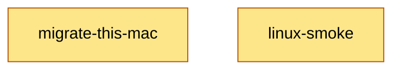

# Task dependency graph

Source of truth: [`TASKS.md`](../TASKS.md) (`**Blocked by**` fields). Update this file when you add or remove a task.

Waves 0–3 are done and merged: scaffold, ADRs, package lists, chezmoi source, skills profiles, AGENTS templates, the core packages (platform, runner, prompt, pkglist, module), the types review, and all 11 installer modules plus `internal/project`.

## Waves for parallel subagents

Each wave can be handed to subagents at the same time. Within a wave, the `**Touches**` sets do not overlap.

| Wave | Tasks | Gate |
|---|---|---|
| 0 | go-scaffold, adr-records, pkg-lists, home-shell, home-claude, chezmoi-config, skills-profiles, agents-templates | none |
| 1 | core-platform, core-runner, core-prompt, pkglist-parser | go-scaffold |
| 2 | core-module | core-platform, core-runner, core-prompt |
| 2b | **types-review** (user) | core-module, pkglist-parser |
| 3 | mod-repo, mod-apt, mod-brew, mod-chezmoi, mod-fish, mod-mise, mod-python, mod-claude, mod-ssh, mod-secrets, mod-skills, project-apply | types-review (+ wave-0 data tasks) |
| 4 | cli-commands | all of wave 3 |
| 5 | release-goreleaser, docs-final | cli-commands |
| 6 | ci-workflow, secret-audit | release-goreleaser / docs-final + wave-0 data tasks |
| 7 | **migrate-this-mac**, **publish-github** (user) | secret-audit (+ ci-workflow) |
| 8 | **linux-smoke** (user) | publish-github |

Bold = tagged `needs-approval`. A subagent must stop and hand back to the user at these tasks.

Shared write-set notes:
- `go.mod` / `go.sum`: go-scaffold (W0), core-prompt (W1, the only W1 task that adds deps), cli-commands (W4). Never two at once.
- `internal/modules/`: each module owns `<name>.go` + `<name>_test.go` only. Registration happens in cli-commands, so the wave-3 modules never share a file. A shared test helper, if needed, goes into `internal/runner` (FakeRunner) and not into `internal/modules`.
- `.github/workflows/`: release-goreleaser owns `release.yml`, ci-workflow owns `ci.yml`.
- Task order is not runtime order. At runtime, `repo` runs first (after `apt` on Linux), because chezmoi, brew, and skills read data from the clone. That ordering comes from `Module.DependsOn`, not from `**Blocked by**`.
- `AGENTS.md`: created now. Only docs-final edits it later.
